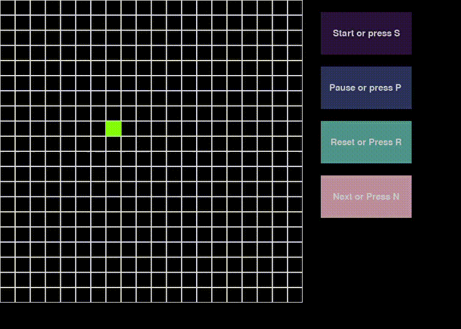

# Conway game of life implementation challenge

## Game of Life Explanation

- The Game of Life is not your typical computer game. It is a cellular automaton, and was invented by Cambridge mathematician John Conway.

- This game became widely known when it was mentioned in an article published by Scientific American in 1970. It consists of a grid of cells which, based on a few mathematical rules, can live, die or multiply. Depending on the initial conditions, the cells form various patterns throughout the course of the game.

## Rules


image from https://playgameoflife.com/info

## Demo

  

## Implementation Overview
```python
class Grid:
    """
    Class to Implement the Game
    
    Args:
    screen_ref: reference to the screen to draw
    block_size: size of the block
    screen_width: screen parameter
    screen_height: screen parameter
    underpopulation_threshhold:default = 2 Alive cell dies if neighbours less than this threshold(exclusive)
    overpopulation_threshold:default = 3 Alive cell dies if neighbours more than this threshold(exclusive)
    reproduction_threshold:default = 3 Dead cell becomes alive if surrounded by exactly this number of cells
    """
```
## Dependencies
- Python 3.x
- Pygame

## How to run
```bash
python game.py
```

Also see -> https://leetcode.com/problems/game-of-life/description/
